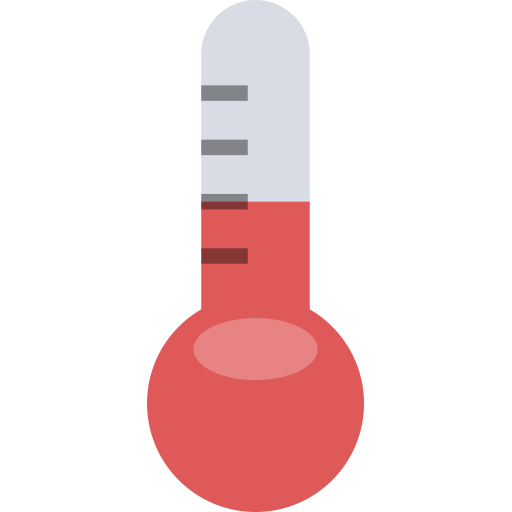

# ETSII ULL Grado de Informatica
## Práctica: Conversor en JavaScript de grados Celsius a Farenheit y viceversa
> Para la asignatura de _Procesadores de Lenguaje_ [link](https://campusvirtual.ull.es/1516/course/view.php?id=178)

Se puede acceder a la práctica por medio del siguiente link
- [Página web de la práctica](http://elediaz.github.io/conversor-de-temperatura-simple-ele-daniel)
- [Portafolio de Daniel](http://alu0100783230.github.io/)
- [Portafolio de Eleazar](http://elediaz.github.io/public/portafolio.html)
- [Enlace a la asignatura](https://campusvirtual.ull.es/1516/course/view.php?id=178)

